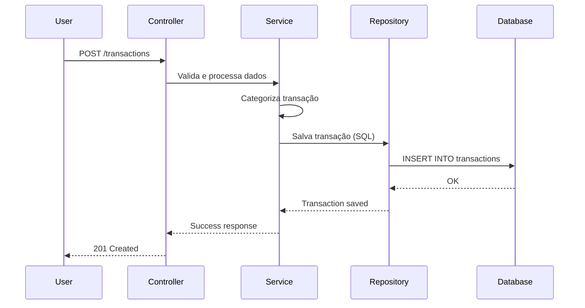

# 🚀 VaultX — Smart Financial Management System

VaultX é um sistema de gestão financeira focado em backend, projetado para ajudar usuários a rastrear, analisar e otimizar comportamentos de gastos por meio de processamento de dados estruturados e insights inteligentes.

O sistema é construído com ênfase em **Clean Architecture**, manipulação de dados **SQL-first** e design escalável, sendo ideal tanto como base para um produto real quanto para um portfólio técnico de alto nível.

---

## 🎯 Propósito

O VaultX visa:
- Coletar dados financeiros (manuais ou importados).
- Categorizar transações de forma inteligente.
- Fornecer análises financeiras estruturadas.
- Viabilizar planejamento baseado em metas.
- Apoiar a tomada de decisão através de insights orientados a dados.

---

## 🧠 Conceitos Core

Diferente de aplicações CRUD tradicionais, o VaultX é desenhado em torno de:
- **Data Pipelines**: Fluxo contínuo de processamento de informação.
- **Behavior Analysis**: Identificação de padrões de consumo.
- **Financial Forecasting**: Previsão de saldo e gastos futuros.
- **Goal-oriented Planning**: Sistema focado em objetivos financeiros.

---

## 🏗️ Arquitetura

O projeto segue uma **Layered Architecture** (Arquitetura em Camadas), separando responsabilidades de forma clara:

- **Controllers**: Gerenciam requisições HTTP e respostas.
- **Services**: Contêm a lógica de negócio e regras do sistema.
- **Repositories**: Executam queries SQL puras (evitando dependência pesada de ORMs).
- **Database**: PostgreSQL otimizado com índices e queries performáticas.

---

## ⚙️ Tech Stack


| Camada       | Tecnologia              |
|--------------|-------------------------|
| **Backend**  | Python + Django         |
| **Database** | PostgreSQL (SQL-first)  |
| **Infra**    | Docker + Docker Compose |
| **API**      | Django REST Framework   |

---

## 🗄️ Database Design

Focado em performance e controle total sobre os dados.

### Principais Entidades
- `users`: Gestão de perfil e autenticação.
- `transactions`: Registro detalhado de movimentações.
- `categories`: Organização hierárquica de gastos.
- `goals`: Planejamento e metas de economia.

### Exemplo de Query (Gasto Mensal)
```sql
SELECT c.name, SUM(t.amount)
FROM transactions t
JOIN categories c ON t.category_id = c.id
WHERE t.user_id = %s
AND DATE_TRUNC('month', t.date) = DATE_TRUNC('month', CURRENT_DATE)
GROUP BY c.name;
```

---

## 🔄 Fluxo de Dados (Sequence Diagram)

Abaixo, o fluxo simplificado de criação de uma transação:



---
