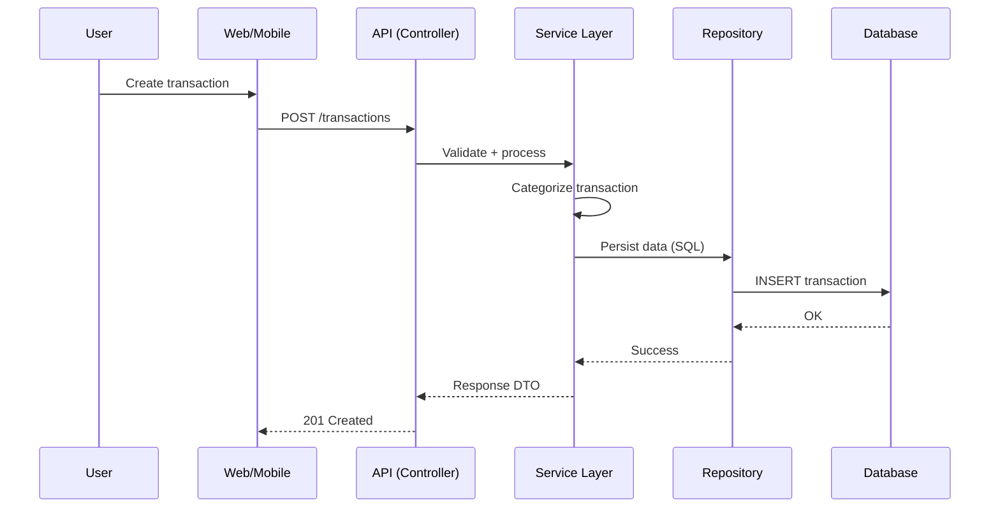

# 🚀 VaultriX — Smart Financial Intelligence System

VaultriX é uma plataforma de inteligência financeira baseada em **arquitetura modular**, projetada para a coleta, análise e previsão de comportamento financeiro. 

O sistema opera sob uma filosofia **API-first**, garantindo integração fluida entre múltiplos clientes (Web, Mobile e integrações externas) e um backend robusto focado em processamento de dados.

---

## 🎯 Objetivo do Sistema

O VaultriX foi desenvolvido para:
- **Centralizar** dados financeiros de diversas fontes.
- **Categorizar** transações de forma inteligente (automática e manual).
- **Gerar análises** comportamentais de gastos.
- **Projetar previsões** financeiras baseadas em histórico (Forecasting).
- **Viabilizar planejamento** através de metas financeiras dinâmicas.

---

## 🧠 Conceitos Arquiteturais

O sistema foge do padrão CRUD comum, focando em:
- **Event-driven financial tracking**: Rastreamento baseado em eventos.
- **Data pipelines**: Processamento estruturado de transações.
- **Separação rígida**: Domínio e Infraestrutura totalmente desacoplados.
- **Service Layer**: Centralização das regras de negócio.
- **API-first design**: Backend independente de cliente.

---

## 🏗️ Arquitetura do Sistema

O VaultriX utiliza uma separação clara de responsabilidades:

### 🔹 Backend (Django + DRF)
- **API Layer**: Exposição de endpoints REST.
- **Service Layer**: Orquestração das regras de negócio.
- **Domain Layer**: Entidades e lógica financeira pura.
- **Infrastructure Layer**: Acesso ao banco via SQL puro e Repositories.

### 🔹 Frontend & Mobile
- **Web (Next.js)**: Interface responsiva com consumo via Axios.
- **Mobile (React Native / Flutter)**: Cliente independente focado em UX rápida.

---

## ⚙️ Stack Tecnológica


| Camada         | Tecnologia                       |
|----------------|----------------------------------|
| **Backend**    | Python + Django + DRF            |
| **Database**   | PostgreSQL                       |
| **Frontend**   | Next.js (React)                  |
| **Mobile**     | React Native / Flutter           |
| **Infra**      | Docker + Docker Compose          |

---

## 🗄️ Modelo de Dados (Resumo)

Entidades principais:
- `users`: Autenticação e perfil.
- `transactions`: Movimentações financeiras detalhadas.
- `categories`: Classificação e agrupamento de gastos.
- `goals`: Metas e planejamento financeiro.

### 📊 Exemplo de Query Financeira
```sql
SELECT c.name, SUM(t.amount) AS total
FROM transactions t
JOIN categories c ON t.category_id = c.id
WHERE t.user_id = %s
AND DATE_TRUNC('month', t.date) = DATE_TRUNC('month', CURRENT_DATE)
GROUP BY c.name;
```

---

## 🔄 Fluxo de Operação (Sequence Diagram)



---

## 🚀 Como Iniciar

1. **Clone o repositório**
2. **Configure o ambiente**: `docker-compose up --build`
3. **Acesse a documentação**: `http://localhost:8000/docs/`
