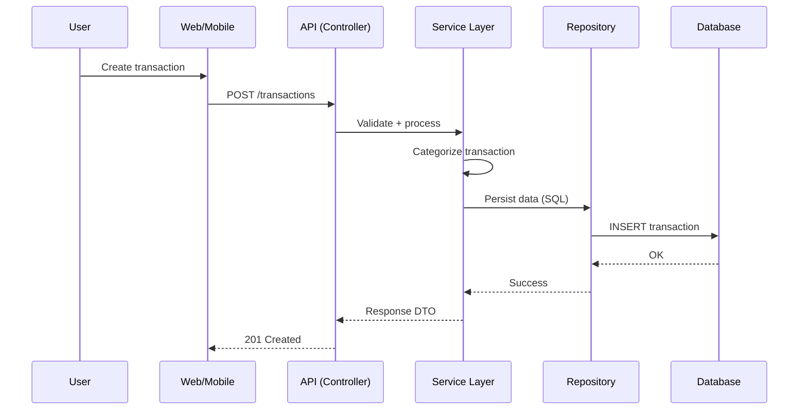

# 🚀 VaultriX — Smart Financial Intelligence System

VaultriX é uma plataforma de inteligência financeira com arquitetura modular e abordagem **API-first**, focada em coleta, análise e previsão de dados financeiros.

---

## 🎯 Objetivo
- Centralizar dados financeiros  
- Categorizar transações  
- Gerar análises de gastos  
- Realizar previsões (forecasting)  
- Apoiar planejamento com metas  

---

## 🏗️ Estrutura

**Backend (Django + DRF)**
- API Layer  
- Service Layer  
- Domain Layer  
- Infrastructure Layer  

**Frontend & Mobile**
- Web: Next.js  
- Mobile: React Native / Flutter  

---

## ⚙️ Stack
- Backend: Python + Django + DRF  
- Database: PostgreSQL  
- Frontend: Next.js  
- Mobile: React Native / Flutter  
- Infra: Docker  

---

## 🗄️ Dados (Resumo)
- `users`  
- `transactions`  
- `categories`  
- `goals`  

---

## 🔄 Fluxo



---

## 🚀 Setup
```bash
docker-compose up --build
```

Docs: http://localhost:8000/docs/
